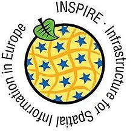

# Interoperabilité

## Open Geospatial Consortium (OGC)

  

L'Organisation internationale de normalisation (dont le nom court est ISO) est un organisme de normalisation international composé de représentants l'organisations nationales de normalisation de 165 pays.

Cette organisation créée en 1947 a pour but de produire des normes internationales dans les domaines industriels et commerciaux appelées normes ISO.

L'Organisation internationale de normalisation se compose de plus de 200 comités techniques

### Processus d’élaboration des normes et produits :

- Proposition,

- Préparation,

- Comité,

- Enquête,

- Approbation,

Normalisation dans le domaine de l'information géographique numérique.

https://www.iso.org/fr/committee/54904/x/catalogue/

Établir un ensemble structuré de normes relatives à l'information sur les objets ou les phénomènes qui sont directement ou indirectement associés à une localisation terrestre.

Ces normes peuvent spécifier, pour l'information géographique, des méthodes, outils et services pour la gestion de données (y compris leur définition et leur description), l’acquisition, le traitement, l'analyse, l'accès, la présentation et le transfert de ces données sous forme numérique / électronique entre les différents utilisateurs, systèmes et sites.

  

## Open Geospatial Consortium (OGC)

  

Organisation internationale à but non lucratif dédiée au développement des systèmes ouverts en géomatique.

Elle a été fondée en 1994 pour répondre aux problèmes de non interopérabilité des applications concernant l'information géographique.
Les missions

- regrouper les acteurs concernés afin de développer et promouvoir les standards ouverts.

- garantir l'interopérabilité dans le domaine de la géomatique

- favoriser la coopération entre développeurs, fournisseurs et utilisateurs

- permettre de réaliser des systèmes et des services d'information complexes et ouverts

- impliquer l’ensemble de la communauté dans le processus d’interopérabilité

https://www.ogc.org/
Fondamental
Des ressources

- Une plateforme (le site)

- les standards internationaux assurant l'interopérabilité

- des retours d'expériences et bonnes pratiques

- une communauté de membres

- des rapports et publications scientifiques

Exemple
Le glossaire

https://www.ogc.org/resources/ogc-glossary/

## Les Géo standards pour une bonne diffusion
Le coeur de FAIR

FAIR / TAIR

Findable, Accessible, Interoperable et Reusable

Trouvable, Accessible, Interopérable et Réutilisable

En évolution permanente => âge du WMS vs âge du COG, plus de 30 ans d'écarts
Rappel
Les Web Services (WMS, WFS, WMTS, WCS, WFS-T...)

Protocoles HTTP (Hyper Text Transfer Protocol) fournissant des images et données géoréférencées par des URL (Uniform Ressource Location) selon des normes standardisées.

Les données sont mises à disposition par des serveurs cartographiques (Geoserver, Mapserver) et directement lues sur un navigateur web grâce à un client carto (OpenLayers) ou sur un logiciel desktop client (Qgis, Arcgis).

Remarque
Parmi les standards de l’OGC

### Des Webservices (distant)

WMS - Web Map Service

WMTS - Web Map Tile Service

WFS - Web Feature Service

WCS - Web Coverage Service

CS-W - Catalog Service Web

WPS - Web Processing Service

### Des formats (en local)

SLD - Style Encoding Description

GML - Geography Markup Language

KML - Keyhole Markup Language

GPKG - Geopackage

WKT CRS – Notation des CRS WKT

## Le Catalogage / Métadonnées

Axe de qualité de notre discipline

La notion de diffusion de donnée a été confirmée par la possibilité de partager des données de qualité.

Des données de qualité => exhaustives, propres et géométriquement correctes

Des données documentées => fiches de métadonnées suivant des normes de rédaction (ISO 19115 / 19139, INSPIRE, DCAT)

Des données diffusables => catalogue de données / métadonnées, Catalogue Service Web CSW

Des données réutilisables => accessibles, ouvertes